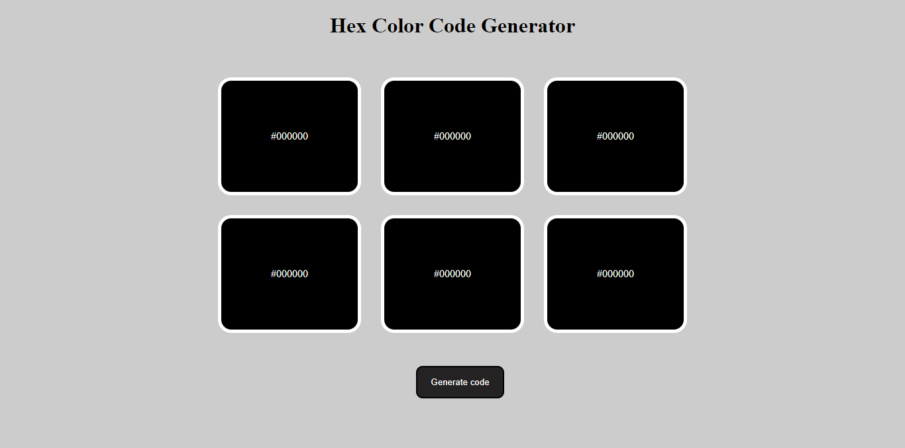
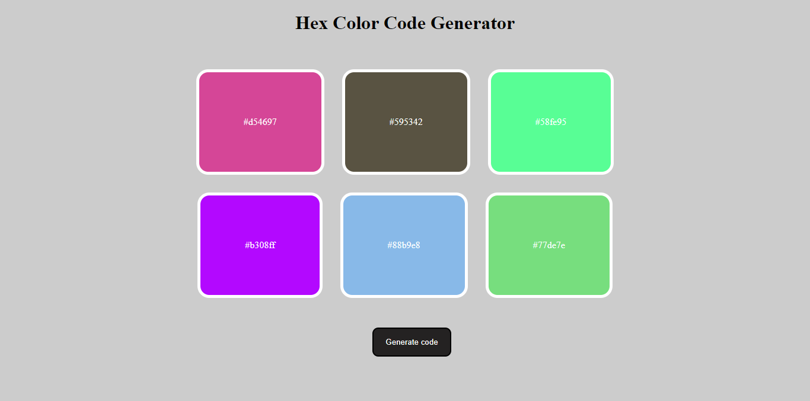

## Javascript Hex color code

### Hello, I am Dipanshu Shukla

I have build Hex color code generator with the help of `HTML`, `CSS` and `JavaScript`.

It helps to get the code of the colors by clicking on the button Generate color.

``` Learning Key points of Javascript```
- Generate the random codes by Math.random(). It gives the random numbers between 0 to 1.
- ```toString(16)```: It converts the random numbers to hex.
- ```substring(2,8):``` It extracts a part of a string from second index to 8th index.
  
This is the live link of the project.

Checkout Here [Live Link](https://dp-hex-color-code.netlify.app)

```First Page```



```Themes```

